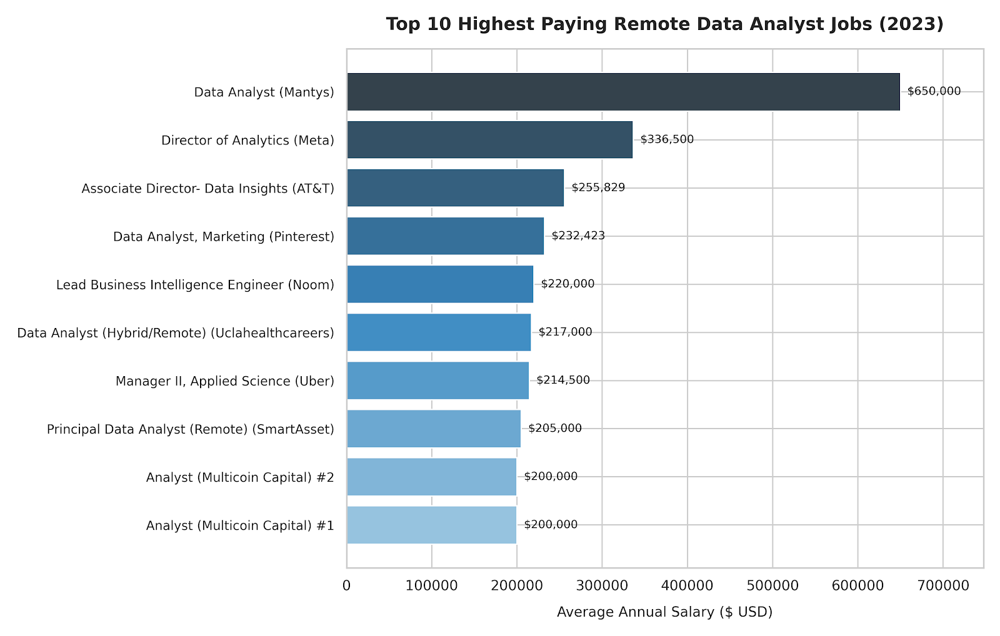

# Introduction
Welcome to my SQL portfolio project! I built this project to sharpen my database querying skills and demonstrate my ability to extract actionable insights from raw data.

Using a comprehensive job market dataset from 2023, this project serves as both a hands-on technical exercise and a deep dive into the foundational trends of the data analytics industry. All the SQL queries used to extract these insights are located in the [`project_sql folder`](/project_sql/) .

## Background
As I focus on transitioning fully into data analytics, I wanted to take a data-driven approach to my own skill development. Instead of relying on generic advice about what tools to learn, I used this 2023 dataset as a sandbox to uncover real trends in salaries, remote work, and tool requirements.

**My goal was to establish a clear baseline of what makes a data analyst valuable and build a strategic learning roadmap. I structured my analysis around five key questions:**
1. What were the absolute highest-paying remote Data Analyst jobs in 2023?
2. What specific skills did those top-tier roles require?
3. Which foundational skills were requested most frequently across the entire market?
4. Which niche skills commanded the highest average salaries?
5. Where was the "sweet spot"—the optimal skills that offered both high job availability and high pay?

# Tools I Used
To analyze this dataset and build this portfolio project, I utilized the following stack:
- **SQL (PostgreSQL):** The core engine for my analysis. I used it to write complex queries, join multiple tables, and aggregate millions of rows of job posting data.
- **Visual Studio Code / DBeaver:** My primary environments for database management and executing SQL scripts.
- **Git & GitHub:** For version control, organizing my code, and sharing my portfolio.

#  Analysis
### 1. Top Paying Jobs
**Goal:** Find the top 10 highest-paying remote roles available for Data Analysts and Business Analysts to see what the top end of the market actually pays.
- **Query File:** - **Query File:** [`query_1_top_paying_jobs`](./project_sql/query_1_top_paying_jobs.sql)

```sql
SELECT
    job_id,
    job_title,
    job_location,
    name AS company_name,
    job_schedule_type,
    salary_year_avg,
    job_posted_date
FROM
    job_postings_fact
LEFT JOIN company_dim ON job_postings_fact.company_id = company_dim.company_id
WHERE
    job_work_from_home = TRUE AND
    salary_year_avg IS NOT NULL AND
    job_title_short IN ('Data Analyst', 'Business Analyst')
ORDER BY 
    salary_year_avg DESC
LIMIT 10;
```

 *Horizontal bar chart showing the top 10 highest-paying remote analyst roles; chart generated from SQL query results by AI.*

 ### Takeaways
 - Wide Pay Range: Top remote roles start around $200,000 and climb up to $650,000, showing that high-impact analytics work commands serious pay.

 - Seniority Matters Most: Most positions crossing the $220,000+ mark carry titles like "Director", "Lead", or "Associate Director", meaning deep business ownership and leadership are where the highest payouts sit.

 - Tech & Growth Companies Dominate: Well-known tech companies (Meta, Uber, Pinterest) and specialized investment/health organizations make up the bulk of top-paying remote listings.

 ### 2. Skills For Top Paying Jobs
**Goal:** Identify the highest-paying remote data analyst positions in the 2023 dataset to understand the absolute top end of the market.
- **Query File:** [`query_2_skills_for_top_paying_jobs folder`](project_sql/query_2_skills_for_top_paying_jobs.sql)

```sql
WITH top_paying_jobs AS (
    SELECT
    job_id,
    job_title,
    name AS company_name,
    salary_year_avg
FROM
    job_postings_fact
LEFT JOIN company_dim ON job_postings_fact.company_id = company_dim.company_id
WHERE
    job_work_from_home = TRUE AND
    salary_year_avg IS NOT NULL AND
    job_title_short IN ('Data Analyst', 'Business Analyst')
ORDER BY
    salary_year_avg DESC
LIMIT 10
)
SELECT 
   top_paying_jobs.*,
   skills
FROM
    top_paying_jobs
INNER JOIN skills_job_dim ON top_paying_jobs.job_id = skills_job_dim.job_id
INNER JOIN skills_dim ON skills_job_dim.skill_id = skills_dim.skill_id
ORDER BY 
    salary_year_avg DESC;
```

*Bar chart showing the most frequently requested skills among the top 10 highest-paying roles; generated from SQL query results BY AI.*


 ### Takeaways
 - The Core Trinity: SQL, Python, and Tableau tied as the most demanded skills, each appearing in 5 of the top postings with defined skill stacks.

- Modern Cloud Stack: High-paying roles frequently pair core query skills with enterprise data infrastructure like AWS, Azure, Databricks, and Snowflake.

- Advanced Data Processing: Libraries like Pandas and frameworks like PySpark emerge alongside Python, proving that top earners handle large-scale transformation beyond basic reporting.

### 3. Most Demanded Skills
**Goal:** Determine the most frequently requested technical skills across remote Data Analyst and Business Analyst job postings to establish baseline market requirements.
- **Query File:** [`query_3_most_demanded_skills folder`](project_sql/query_3_most_demanded_skills.sql)

```sql
SELECT 
    skills,
    COUNT(skills_dim.skill_id) AS skills_count
FROM
    skills_dim
INNER JOIN skills_job_dim ON skills_dim.skill_id = skills_job_dim.skill_id
INNER JOIN job_postings_fact ON skills_job_dim.job_id = job_postings_fact.job_id
WHERE 
    job_title_short IN ('Data Analyst', 'Business Analyst') AND
    job_work_from_home = TRUE
GROUP BY 
    skills
ORDER BY
    skills_count DESC
LIMIT 6;
```
| Skill | Job Postings Demand |
| :--- | :--- |
| SQL | 8,557 |
| Excel | 5,594 |
| Python | 4,876 |
| Tableau | 4,473 |
| Power BI | 3,164 |
| R | 2,396 |

 ### Takeaways
 - SQL is the Foundation: Appearing in 8,557 postings, SQL is required far more than any other tool, solidifying its place as the single most critical baseline skill for analysts.
 - Spreadsheets Remain Vital: Excel ranks second with 5,594 postings, proving that traditional spreadsheet modeling remains indispensable alongside modern programming languages.

- Programming & BI Breakdown: Python (4,876) comfortably leads R (2,396) as the primary scripting language, while Tableau (4,473) edges out Power BI (3,164) in overall remote market demand.

### 4. Top Skills Based On Salary
**Goal:** Determine the most frequently requested technical skills across remote Data Analyst and Business Analyst job postings to establish baseline market requirements.
- **Query File:** [`query_4_top_skills_based_on_salary folder`](project_sql/query_4_top_skills_based_on_salary.sql)

```sql
SELECT
    skills,
    ROUND(AVG(salary_year_avg), 0) AS salary_based_on_skills
FROM
    job_postings_fact
INNER JOIN skills_job_dim ON job_postings_fact.job_id = skills_job_dim.job_id
INNER JOIN skills_dim ON skills_job_dim.skill_id = skills_dim.skill_id
WHERE
    salary_year_avg IS NOT NULL AND 
    job_title_short IN ('Data Analyst', 'Business Analyst') AND
    job_work_from_home = TRUE
GROUP BY
    skills
HAVING
    COUNT(skills_dim.skill_id) > 50
ORDER BY
    salary_based_on_skills DESC
LIMIT 20;
```
| Skill | Average Annual Salary |
| :--- | ---: |
| Looker | $106,259 |
| Python | $102,578 |
| R | $101,223 |
| Tableau | $99,807 |
| SAS | $98,908 |
| SQL | $97,417 |
| Power BI | $96,744 |
| PowerPoint | $89,661 |
| Excel | $88,027 |
| Word | $84,012 |

 ### Takeaways
 - Modern BI & Programming Cross the Six-Figure Mark: Looker ($106,259), Python ($102,578), and R ($101,223) lead the highest average salaries among common skills (>50 postings), showing the financial value of scripting and modern BI tools.

- Core BI & Querying Range in the Upper $90Ks: Foundational tools like Tableau ($99,807), SQL ($97,417), and Power BI ($96,744) consistently average near six figures.

- Productivity Tools Sits at the Baseline: General office applications like Excel ($88,027) and Word ($84,012) lag behind programming and dedicated BI platforms by $10,000–$20,000 annually.

### 5. Most Optimal Skills
**Goal:** Identify high-value skills that balance strong job security (demand count > 10) with top earning potential for remote Data and Business Analysts.

- **Query File:** [query_5_most_optimal_jobs folder](project_sql/query_5_most_optimal_jobs.sql)

```sql
SELECT
    skills_dim.skill_id,
    skills_dim.skills,
    COUNT(job_postings_fact.job_id) AS skill_count,
    ROUND(AVG(salary_year_avg), 0) AS avg_salary
FROM
    job_postings_fact
INNER JOIN
    skills_job_dim ON job_postings_fact.job_id = skills_job_dim.job_id
INNER JOIN 
    skills_dim ON skills_job_dim.skill_id = skills_dim.skill_id
WHERE
    job_title_short IN ('Data Analyst', 'Business Analyst')
    AND job_work_from_home = TRUE
    AND salary_year_avg IS NOT NULL
GROUP BY
    skills_dim.skill_id
HAVING
    COUNT(job_postings_fact.job_id) > 10
ORDER BY
    avg_salary DESC,
    skill_count DESC
LIMIT 10;
```
*Query Optimization Note: While this can be built using multiple CTEs to separate demand and salary metrics, this single-query approach aggregates both metrics in one pass, minimizing I/O and execution time.*

| skill_id | Skill | Posting Count | Average Annual Salary |
| :---: | :--- | ---: | ---: |
| 75 | Databricks | 11 | $139,006 |
| 80 | Snowflake | 38 | $112,989 |
| 97 | Hadoop | 25 | $111,849 |
| 8 | Go | 30 | $111,121 |
| 77 | BigQuery | 16 | $110,813 |
| 74 | Azure | 35 | $110,804 |
| 234 | Confluence | 14 | $108,415 |
| 76 | AWS | 32 | $108,317 |
| 194 | SSIS | 12 | $106,683 |
| 185 | Looker | 54 | $106,259 |

 ### Takeaways
 - Data engineering and cloud warehousing command the highest pay in the market. Databricks leads at $139,006, followed by Snowflake ($112,989) and BigQuery ($110,804), proving that enterprise pipeline skills drive top-tier compensation.

- Major cloud ecosystems provide predictable, high-value career paths with six-figure parity, including Azure (35 postings at $110,804) and AWS (32 postings at $108,317).

- Looker serves as the optimal sweet spot among BI tools, combining the highest demand in this tier with 54 postings and a strong average salary of $106,259.

# What I Learned
Executing this project allowed me to significantly level up my practical SQL problem-solving skills:

- Complex Joins: I learned how to seamlessly connect fact and dimension tables using intermediate bridge tables (skills_job_dim).

- Data Aggregation: I became comfortable utilizing GROUP BY with aggregate functions like COUNT() and AVG() to pull meaningful, high-level metrics out of massive datasets.

- Query Optimization & Execution: I gained a practical understanding of execution order—specifically when to use WHERE (filtering raw data before grouping) versus HAVING (filtering aggregated metrics after grouping), which was essential for isolating accurate salary trends.

# Conclusion
Based on this analysis of the job market, the data outlines a straightforward path for aspiring analysts:

- Master the Non-Negotiables: SQL and Excel are mandatory for baseline market viability.

- Learn to Code: Python is the most valuable addition to a basic analyst stack, opening doors to advanced analytics and higher-paying roles.

- Target Cloud Tech for Salary Bumps: Adding tools like Snowflake or AWS to your repertoire is the most reliable way to push into senior salary bands once your technical foundation is set.


